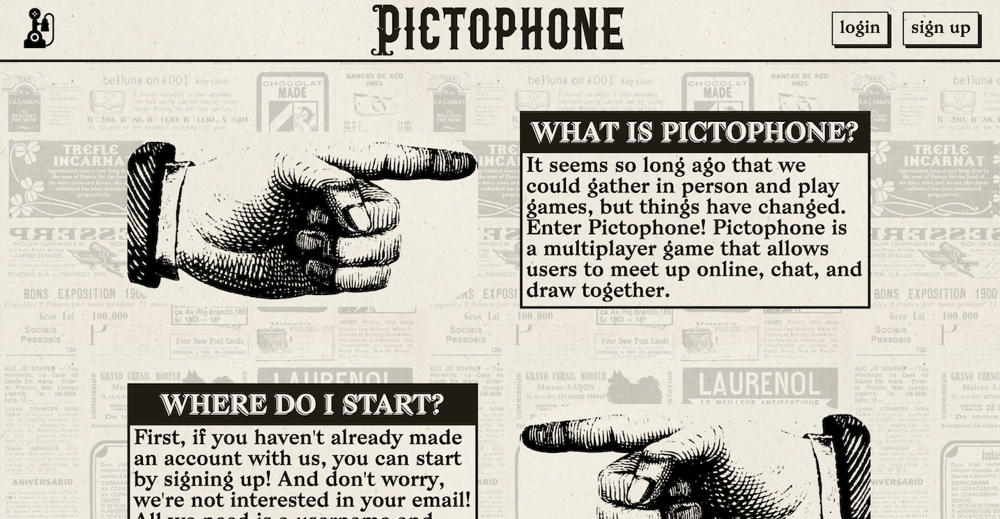
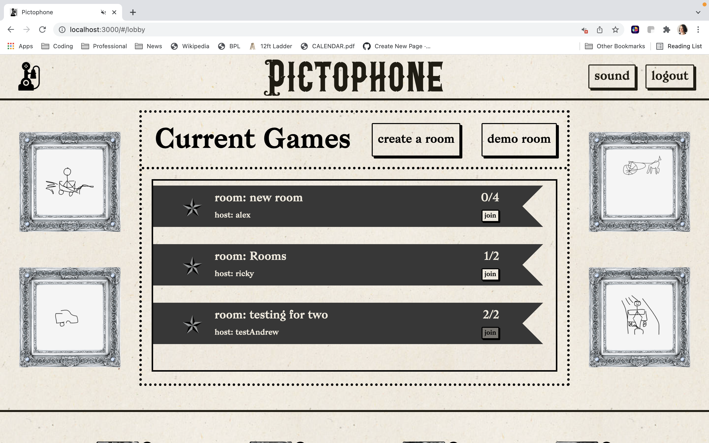

# Welcome to Pictophone!

 [Pictophone](https://pictophone.herokuapp.com/#/) is an online, multiplayer, collaborative drawing game.
 
 

## Background and Overview

Do you remember people? Not photos of them on your screen, but a real live breathing person within 6 feet of you? It seems so long ago that we could gather and play drawing based games! In a post-covid society we yearn for the next online group experience...

Enter Pictophone!

Upon signing up or logging in, Pictophoners<sup>tm</sup> can create or join their own online party rooms. Upon entering a room, a user can communicate with others in the room via live chat and participate in a communal 'free draw' session while they are waiting for the start of the game. 

During gameplay each player will receive a unique prompt and attempt to draw it. Once everyone has submitted, their drawing will be passed to the subsequent player, who will guess the prompt! Their guess is then passed to the next player who will create a drawing based off of the guess! The cycle continues until the last player in the cycle guesses. When the cycle ends players will see the journey their drawings and guesses took and how they mutated over time. As a team, we were interested in building a turn-based game that integrates live functionality and offers a user-friendly design. The technologies implemented in this project include:

* Languages: JavaScript, HTML, and CSS
* Frontend: React-Redux
* Routes and Backend: Express.js and MongoDB
* Hosting: Heroku
* Drawing Board: HTML5 Canvas API
* Websockets: Socket.io
* Asset Storage: AWS Simple Cloud Storage (S3)

# MVP Features

## Lobby/Rooms



After signing up or logging in, users will be taken to Pictophone's main lobby and greeted by previously created rooms. Players are free to join those rooms or create a new one as a host. If players try to join a room, our full stack structure checks to see if that user has already joined the room or if that room is full. If it is not full and the player has not joined, their unique identifier is persisted to the backend and the frontend will route them to that unique room:

```javascript

// Joining existing rooms (frontend)

const join = (e) => {
    e.preventDefault();
    props.requestAllRooms()
        .then(
            () => {
                if(room.size > room.players.length) {
                    props.updateRoom({ 'roomId': room._id, 'playerId': currentUser.id})
                        .then( () => props.history.push(`/rooms/${room._id}`))
                } else {
                    props.roomFullError(props.room._id);
                }
            }
        )
}


// Room creation and error handling (frontend)

handleSubmit = (e) => {
        e.preventDefault();
        this.props.formAction(this.state)
            .then(() => {
                if(this.props.errors.length === 0){
                    this.props.closeModal()
                }
            }
        )
    }

componentDidUpdate(prevProps, prevState){
    if(prevState.name !== this.state.name){
        if (this.props.errors.length !== 0)this.props.clearErrors()
    }
}

// Create room modal (frontend)

const Modal = ({modal, closeModal}) => {
    if(!modal) return null;
    let component;
    switch (modal) {
        case "createRoom":
            component = <CreateRoomContainer />
            break;
        default:
            return null;
    }

    return (
        <div className='modal-background' onClick={closeModal}>
            <div className='modal-child' onClick={(e => e.stopPropagation())}>
                {component}
            </div>
        </div>
    )
}

`````

```javascript

// Create room (backend)

router.post("/", 
  passport.authenticate('jwt', { session: false }),

  (req, res) => {
    const { errors, isValid } = validateRoomInput(req.body);
    if (!isValid) {
      return res.status(400).json(errors);
    }
    Room.findOne({ name: req.body.name })
      .then(room => {
        if (room) {
          errors.name = "Room with that name already exists";
          return res.status(400).json(errors)
        } else {
          const newRoom = new Room({
            name: req.body.name,
            size: req.body.size,
            host: req.body.host_id
          });
          newRoom.save().then(room => res.json(room));
        }
      })
  }
)

// Add new player to room (backend)

router.patch("/:room_id",
  passport.authenticate('jwt', { session: false }),
  (req, res) => {
    Room.findById(req.params.room_id)
      .then(room => {
        !room.players.includes(req.body.playerId) && room.players.length < room.size ?
        room.players.push(req.body.playerId) : 
        room.players.splice(room.players.findIndex(id => id === req.body.playerId), 1);
        room.save({players: room.players}).then(res.json(room));
      })
      .catch(err => 
        res.status(404).json({ noroomfound: 'No room found with that ID' }))
  }
)
````

## Game Drawings & Guesses


After all players have joined a room and a game begins, each player is given a randomly generated prompt and asked to draw it for the next user. After that drawing is passed down the "chain" to the next user, they are asked to guess what the prompt for that drawing was. This was a challenging process that involved converting our canvas manipulation to a blob asset, uploading it to AWS S3, and persisting that drawing's unique identifiers to the backend. Once the turn changed and the next player needed those drawings, it required fetching the correct drawings in our game "chain". On the frontend, this involved crafting an algorithm from scratch that could identify a player's placement in the "chain" and know which respective drawings and guesses they needed for each turn. The algorithm utilized the unique room's identifier and a generated chain identifier to satisfy this demand:

```javascript

// Start game (frontend)

<button className='start-button' onClick={this.startGame}>Start</button>
{this.props.modal === "game" ? <GameContainer prompts={this.prompts} room={this.props.room} /> : ""}

startGame() {
    this.socket.emit('start-game', this.props.roomId)
    this.props.openModal('game')
}
                        
````

```javascript
// Save player's drawing (backend)

router.post("/", 
  passport.authenticate('jwt', { session: false }),
  (req, res) => {
    Drawing.findOne({ assetUrl: req.body.assetUrl })
      .then(drawing => {
        if (drawing) {
          errors.assetUrl = "Drawing with that assetUrl already exists";
          return res.status(400).json(errors)
        } else {
          const newDrawing = new Drawing({
            assetUrl: req.body.assetUrl,
            roomId: req.body.roomId,
            userId: req.body.userId,
            chainId: req.body.chainId
          })
          newDrawing.save().then(drawing => res.json(drawing));
        }
      })
  }
)

// Save player's guess (backend)

router.post("/",
  passport.authenticate('jwt', { session: false }),
  (req, res) => {
    const { errors, isValid } = validateGuessInput(req.body)
    if (!isValid) {
      return res.status(400).json(errors);
    }
    const newGuess = new Guess({
      word: req.body.word,
      roomId: req.body.roomId,
      userId: req.body.userId,
      chainId: req.body.chainId
    })
    newGuess.save().then(guess => res.json(guess));
  }
)
````

## Free Draw


Prior to starting a game, users are able to engage in a shared drawing canvas either solo or with other players also occupying the same room. In order to accomplish this functionality, we needed to write custom websocket events and actions that listened for canvas manipulation on a user's frontend. After canvas manipulation occurs, it is relayed via our websocket emit to our base connection and sent out to all other user's socket connections in that specific room. This allows users to share canvases, but only in their respective rooms and not globally.

```javascript

// Capture and send drawing data (frontend)

const drawLine = function () {
      that.ctx.beginPath();
      that.ctx.moveTo(prevPos.x, prevPos.y);
      that.ctx.lineTo(currentPos.x, currentPos.y);
      that.ctx.closePath();
      that.ctx.stroke();

      if (that.timeout !== undefined) clearTimeout(that.timeout);
      that.timeout = setTimeout(function () {
          const drawingData = that.canvas.toDataURL("image/png");
          that.socket.emit("send-drawing", drawingData, that.props.roomId);
      }, 1000)
  };
````

## Live Chat

Prior to starting a game, users are also able to engage in a live chat with other players also occupying the same room. In order to accomplish this functionality, we needed to write additional websocket events and actions that listened for user message input. After this occurs, their message input is relayed via our websocket emit to our base connection and sent out to all other user's socket connections in that specific room. This allows users to communicate with each other, but again, only in their respective rooms and not globally.

```javascript

// Chat setup (backend)

const io = require('socket.io')(server, {
    cors: {
        origin: ["http://localhost:3000", "https://pictophone.herokuapp.com/"],
        transports: ["websocket", "polling"]

    }
})
    
io.on('connection', socket => {
    socket.on('send-message',  (message, room) => {
        socket.to(room).emit('receive-message', message)
    })
    socket.on('join-room', (room) => {
        socket.join(room)
    })

// Chat setup (frontend)

 this.socket = socket;
        this.socket.on('receive-message', message => {
    
            this.createMessage(message)
        })

  createMessage(message) {
        const text = message.message
        const user = message.user
        const newMessage = document.createElement('div')
        
        newMessage.innerText = `${user}: ${text}`
        
        document.getElementById('chatMessages').appendChild(newMessage)
        

    }

    handleSubmit(e) {
        e.preventDefault()
        const message = this.state.message
        const user = this.props.user.username
        const messageDiv = document.createElement('div')
        messageDiv.innerText = `${user}: ${message}`
        document.getElementById('chatMessages').appendChild(messageDiv)
        

        this.socket.emit('send-message', {user, message}, this.props.roomId)
        this.setState({message: ''})
    }
````

# Our Team

Team Lead: [Stephanie Soni](https://github.com/ashes4trees)

Frontend Lead: [Alex Dziuba](https://github.com/AlexD89)

Backend Lead: [Kyle Ginzburg](https://github.com/keginzburg)

Flex Lead: [Andrew Vitovitch](https://github.com/alvitovitch)


# Thanks!

Pictophone was created within a 4 day time frame. Thank you for your time and consideration! We hope you enjoy it!
